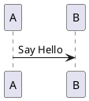

# Plantview

PlantUML viewer

# Features

- Hot Module Replacement (HMR) will help you to write and confirm seamlessly
- Works even in Offline
- You can use your favorite editor to write UML
- Easy Installation with Docker

# Getting Started

First, install Plantview:

```
npm -g install plantview
```

Write your UML:



Then, run the following command:

```
plantview my-diagram.uml
```

You will see your default browser launch. Every time you update the UML file, your browser will automatically reload it.
