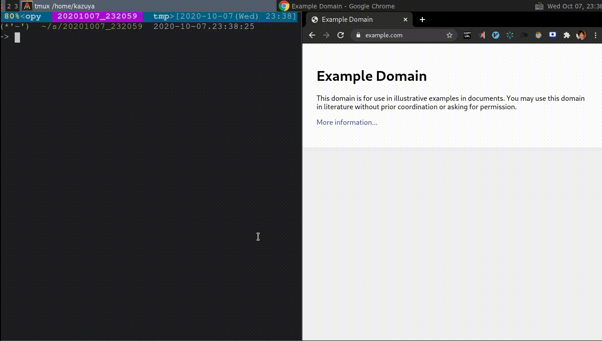
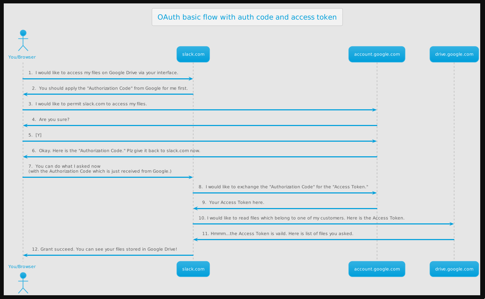

# Plantview

PlantUML viewer powered by Docker + Webpack HMR



# Features

- Hot Module Replacement (HMR) will help you to seamlessly write and preview UML
- Easy installation with Docker + NPM
- Super fast, dockerized local plantuml server
- Works even in Offline
- You can use your favorite editor

# Prerequisites

- Docker
- Node >= 10

# Getting Started

First, install Plantview:

```
docker pull plantuml/plantuml-server
npm -g install plantview
```

Write your UML:

```plantuml
' my-diagram.uml

!include https://raw.githubusercontent.com/bschwarz/puml-themes/master/themes/bluegray/puml-theme-bluegray.puml

title OAuth basic flow with auth code and access token

actor "You/Browser" as b
participant "slack.com" as s
participant "account.google.com" as a
participant "drive.google.com" as d

b -> s: 1.  I would like to access my files on Google Drive via your interface.
s -> b: 2.  You should apply the "Authorization Code" from Google for me first.
b -> a: 3.  I would like to permit slack.com to access my files.
a -> b: 4.  Are you sure?
b -> a: 5.  [Y]
a -> b: 6.  Okay. Here is the "Authorization Code." Plz give it back to slack.com now.
b -> s: 7.  You can do what I asked now \n(with the Authorization Code which is just received from Google.)
s -> a: 8.  I would like to exchange the "Authorization Code" for the "Access Token."
a -> s: 9.  Your Access Token here.
s -> d: 10. I would like to read files which belong to one of my customers. Here is the Access Token.
d -> s: 11. Hmmm...the Access Token is vaild. Here is list of files you asked.
s -> b: 12. Grant succeed. You can see your files stored in Google Drive!
```

Then, run the following command:

```
plantview my-diagram.uml
```



You will see your default browser launch. Every time you update the UML file, your browser will automatically reload it!
