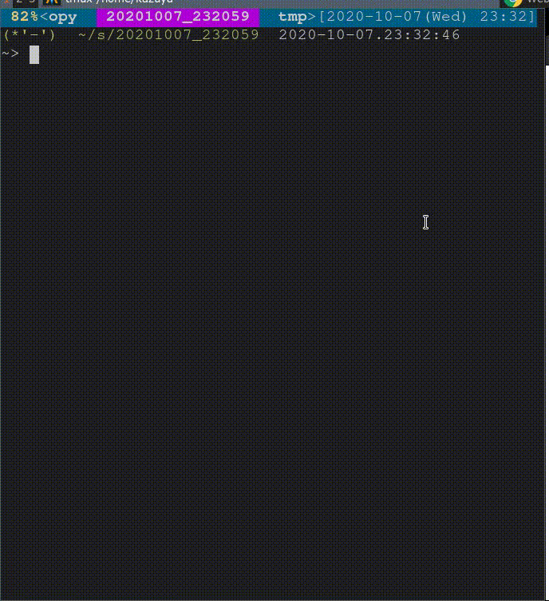

# Plantview

PlantUML viewer powered by Docker + Webpack HMR



# Features

- Hot Module Replacement (HMR) will help you to seamlessly write and preview UML
- Easy installation with Docker + NPM
- Super fast, dockerized local plantuml server
- Works even in Offline
- You can use your favorite editor

# Prerequisites

- Docker
- Node >= 10

# Getting Started

First, install Plantview:

```
docker pull plantuml/plantuml-server
npm -g install plantview
```

Write your UML:

```plantuml
' my-diagram.uml

A -> B: Say Hello
```

Then, run the following command:

```
plantview my-diagram.uml
```

You will see your default browser launch. Every time you update the UML file, your browser will automatically reload it!
